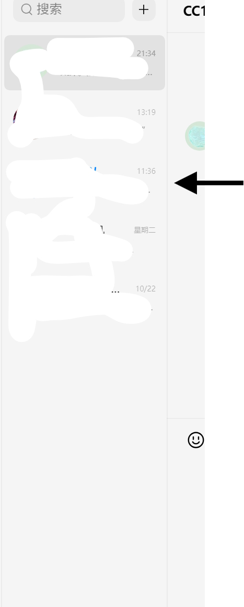

# VisionQQ - 基于纯视觉的 QQ 自动回复机器人
使用纯图像识别技术实现 QQ 消息自动回复，极大降低封号风险。仅支持 Windows 系统。

### 🌟 项目简介

VisionQQ 是一个基于计算机视觉（CV）与 OCR 技术的 QQ 聊天机器人。它不依赖 QQ 内部 API 或模拟输入，而是通过“截图 → 图像处理 → OCR 识别 → LLM 回复生成 → 自动输入”流程完成全自动聊天响应。

### ✅ 优势：
- 零注入、零 Hook，几乎无封号风险
- (可以)纯本地运行，隐私安全
- 支持自定义大模型（如 Ollama）进行智能回复

### ⚠️ 限制：
- 仅支持 Windows 平台
- 对屏幕分辨率、缩放比例敏感
- OCR 识别准确率受字体、背景干扰影响

### 🔧 实现原理

1. 窗口置顶：使用 FocusqqWindow.exe 强制将 QQ 主窗口置顶，确保截图一致性。
2. 缩放适配：运行 ScaleToINI.exe 自动检测系统 DPI 缩放比例，并写入配置文件（如 config.ini），用于后续坐标校准。
3. 红点检测：在联系人列表区域扫描未读消息红点（小红圆点），定位目标会话。
4. 点击交互：模拟鼠标点击红点所在位置，打开聊天窗口。
5. 图像增强 + OCR：
截取聊天内容区域
应用对比度增强、二值化等预处理提升 OCR 效果
使用 [EasyOCR](https://github.com/JaidedAI/EasyOCR) 提取文本内容
6. 智能回复生成：
将识别出的消息传入本地大语言模型（如 Ollama 运行的 Llama3、Qwen 等）
获取回复文本
7. 自动发送：
将回复文本粘贴至 QQ 输入框
模拟回车键发送消息
8. 清理会话：发送后关闭当前聊天窗口，准备下一轮监听。

📦 安装指南
步骤一：下载项目
前往 [Releases] 下载最新版本的所有压缩包并解压。
步骤二：安装依赖
双击运行 install.cmd（需联网）：
会自动安装：`easyocr,pillow,pyautogui,pyperclip,requests,ollama,colorama,pyautogui` 等依赖包。
步骤三：配置模型
推荐安装 [Ollama](https://ollama.com/) 并拉取模型：
bash
ollama pull huihui_ai/gemma3-abliterated:1b
或修改 config.ini 指向本地模型服务地址（支持 HTTP API 接口）
步骤四：设置参数
运行 `设置.exe` 配置

▶️ 使用方法

1. 打开 QQ 客户端并登录账号。
2. 确保 QQ 主界面可见（不要最小化）。
3. 双击运行 run.bat 启动主程序。
4. 程序将自动监控未读消息并回复。
💡 建议保持 QQ 窗口不被遮挡，避免多显示器错位问题。

⚠️ 使用注意事项

为了提高识别准确率，请按如下设置 QQ：
----------------
|设置项| 推荐值|
-------- --------
|联系人面板宽度 |拉到最窄（便于红点定位）|
|字体大小| 调至“最小”|
|聊天背景| 建议使用默认白色背景|
|系统缩放 |推荐 100% 或 125%，避免过高缩放导致坐标偏移|

## 编译
本项目使用 `Python 3.13` 编写，依赖包见 `requirements.txt`。
同时，你还需要用C++编译器编译 `FocusqqWindow.exe` 和 `ScaleToINI.exe`。
接着是用 Visual Studio 2022 编译 `Opt.cs`。

📌 参考图示：

🛡️ 免责声明

本软件仅供技术学习与研究用途，禁止用于任何非法场景（如骚扰、诈骗、刷屏等）。使用者须遵守国家相关法律法规，因使用本软件引发的一切法律责任，均由用户自行承担，与作者无关。

📄 开源协议

本项目遵循 [MIT License](LICENSE)，欢迎 Fork、Star 与贡献代码！

🙌 贡献与反馈

欢迎提交 Issue 或 Pull Request！
