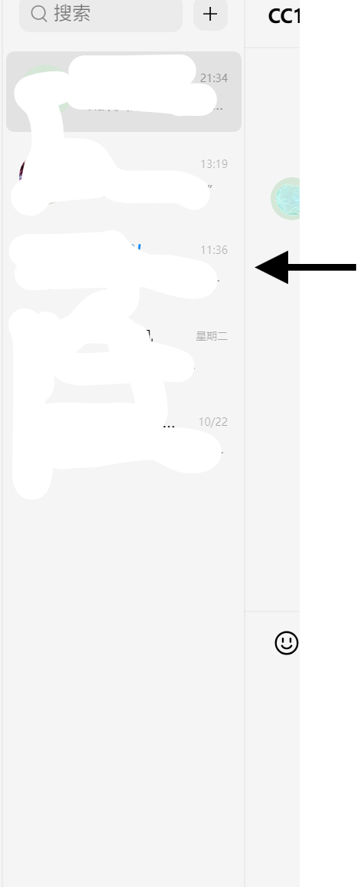

```plain text
   ____     ____    _____    _   _           _   
  / __ \   / __ \  |  __ \  (_) | |         | |  
 | |  | | | |  | | | |__) |  _  | |   ___   | |_ 
 | |  | | | |  | | |  ___/  | | | |  / _ \  | __|
 | |__| | | |__| | | |      | | | | | (_) | | |_ 
  \___\_\  \___\_\ |_|      |_| |_|  \___/   \__|
                                        
```
# QQPilot - 基于窗口自动化的 QQ 自动回复机器人

[Linux版本](https://github.com/QQPilotOrganization/QQPilotLinux)

<div align="center">


</div>

<!-- [](./QQPilot.jpeg) -->
<div align="center">


</div>


> 使用纯视觉 + 窗口自动化实现 QQ 消息自动回复，**零 API 依赖、零注入、低封号风险**。  

##  项目简介

QQPilot 是一个全自动的 QQ 聊天机器人，通过以下流程实现智能回复：

> **复制聊天内容 → 解析消息（含图片/表情包）→ 调用 LLM 生成回复 → 模拟输入并发送**

全程 **不调用 QQ 内部接口、不 Hook 进程、不注入 DLL**，极大降低账号封禁风险。

---

## 安装指南

### 步骤 1：下载项目
前往 [Releases 页面](https://github.com/Na2Cr2O7/QQPilot/releases) 下载最新压缩包并解压。

解压后大小<6M.

可能需要安装[.NET10](https://dotnet.microsoft.com/en-us/download/dotnet/thank-you/sdk-10.0.203-windows-x64-installer)


### 步骤 2：配置大模型（推荐使用 Ollama）

安装 [Ollama](https://ollama.com/) 并拉取模型：

```bash
# 推荐主力模型（8B，性能与效果平衡）
ollama pull huihui_ai/deepseek-r1-abliterated:8b

# 低配设备可选（0.5B，轻量快速）
ollama pull qwen2.5:0.5b

# 视觉多模态模型（实验性，效果一般，慎用）
ollama pull huihui_ai/qwen3-vl-abliterated:latest
```

* 可以在虚拟机上使用，详情见[教程](useollamainVM/useOllamainVM.md)

<!-- ~~  💡 强烈建议使用纯文本模型。当前本地视觉模型对表情包/截图理解能力有限，易出错。~~ -->

> 如需使用自定义 API（如 OpenAI、Claude、自建 LLM），请在 `设置.exe` 中配置。

### 步骤 3：初始化设置
运行 `设置.exe` 配置模型类型、API 地址、截图区域等参数。


## ▶️ 使用方法

1. （可选）将自定义表情包放入 `.\Images` 文件夹  
2. 打开 QQ 客户端并登录账号  
3. **确保 QQ 主窗口始终可见（不要最小化或遮挡）**  
4. 双击运行 `QQPilot菜单` 启动主程序  
5. 程序将自动监控未读消息并智能回复

> ******运行期间请勿更改 DPI/分辨率！******


---

## ⚙️ QQ 推荐设置（提升识别准确率）

| 设置项             | 推荐值                     |
|--------------------|---------------------------|
| **发送消息**          | **Ctrl+Enter**             |
| 联系人面板宽度     | 拖动至**最窄**             |
<!-- | 自动更新          | **关闭**             | -->
<!-- | 字体大小           | 设为“**最小**”            | -->
<!-- | 聊天背景           | 使用**默认白色背景**       | -->
<!-- | 系统显示缩放       | **100% 或 125%**（避免 150%+）| -->

<!-- > 📷 参考图示：

 -->

---

## 核心优势

- **安全无痕**：纯视觉操作，零注入、零 Hook，几乎无封号风险  
- **隐私可控**：支持完全本地运行，数据不出设备  
- **灵活扩展**：可对接任意Open AI API本地大模型（如 Ollama）或远程 HTTP API  


---


## 配置要求

>  ⚠️该程序不支持无头模式（至少外接一台显示器）

### 最低要求

### AMD64

#### Windows
 - Windows 8.1 或更高版本 64位

 - 单核处理器，主频1GHz以上

 - 1GB RAM

 - 200M 可用空间

 - 1920x1080 显示器

> 对于windows7 可以尝试安装 [VkKex](https://github.com/YuZhouRen86/VxKex-NEXT)


### ARM64

 - Windows 10ARM64 及以上

 - 1GB RAM

 - 200M 可用空间

 - 1920x1080 显示器


### 推荐配置

 - Windows 10 x64

 - 4核心，2GHz以上

 - 4GB RAM

 - 8GB 可用空间(用于Ollama)

 - 支持CUDA的GPU

- 1920x1080 显示器
 

---

## ⚠️ 使用限制

- 需图形界面，不支持服务器/远程桌面无头模式/窗口管理器  
- 对 **屏幕分辨率** 和 **DPI 缩放比例** 敏感（推荐设置为 **100% 或 125%**）  
- QQ 主窗口必须 **可见且未最小化**（不可被其他窗口遮挡）

---

## 🔧 工作原理

1. **窗口置顶**  
   通过 `FocusqqWindow.dll`强制将 QQ 主窗口置顶，确保截图一致性。

2. **DPI 自适应**  
   运行 `ScaleToINI.exe` 自动检测系统缩放比例，并写入 `config.ini` 用于坐标校准。

3. **未读消息检测**  
   在联系人列表区域扫描“小红点”，定位有新消息的会话。

4. **自动交互**  
   模拟鼠标点击红点位置，打开对应聊天窗口。

5. **内容识别**  
   - 使用框选功能提取聊天内容（含文本与图片）
   - 示例格式：
     ```markdown
     Username: 11-01 08:12:19
     
     内容内容内容...

     aaaaaaaaaaa: 11-25 08:10:36
     普通文字，没有图片

     bbbbbbbbbbb: 11-25 08:11:00
     
     还有这张图！
     ```
   - 支持提取普通文本、时间戳、用户昵称及本地图片路径
   - 可识别并提取表情包（需启用视觉模型）

6. **智能回复生成**  
   将解析后的内容传入本地大模型（如 Ollama）或自定义 HTTP API，生成自然语言回复。

7. **自动发送**  
   - 将回复粘贴至 QQ 输入框  
   - （可选）随机插入 `.\Images` 中的表情包  （Linux不支持） 
   - 模拟回车键发送消息

8. **会话清理**  
   发送完成后自动关闭当前聊天窗口，返回主界面继续监听。


---

## 🛠️ 编译说明（开发者）

使用 **Visual Studio 2026** 打开并编译以下解决方案（仅Windows）：
- `VisionQQ_C.slnx`
- `QQPilot4\QQPilot4.slnx`

---

## 🛡️ 免责声明

本软件 **仅限技术学习与研究用途**，严禁用于：
- 自动骚扰、刷屏、诈骗等恶意行为  
- 违反《QQ 软件许可协议》的操作  
- 任何违法违规场景

使用者须自行承担因使用本软件引发的一切法律责任，作者概不负责。

本项目采用 [MIT License](LICENSE)


